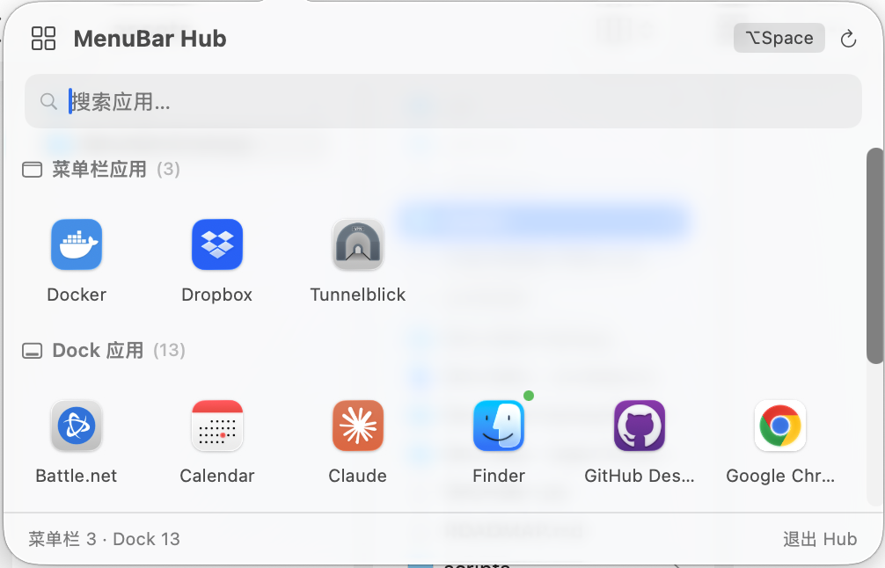

# MenuBarHub

**All your menu bar apps, one click away.**

MenuBarHub is a free macOS menu bar manager that shows all your running apps — including menu-bar-only apps like Tunnelblick, iStat Menus, and others — in a single, searchable grid panel.




## Why?

If your menu bar looks like this — icons crammed together, some hidden behind the notch, and you can never find the one you need — MenuBarHub is for you.

Unlike Bartender or Hidden Bar that simply hide icons, MenuBarHub gives you a **launchpad for your menu bar**. Click one icon, see everything.

## Features

- **Grid panel** — All running apps displayed in a clean, searchable grid
- **Menu bar apps included** — Shows apps like Tunnelblick, 1Password, Docker that only live in the menu bar
- **Click to activate** — Click any app to switch to it; menu bar apps trigger their dropdown menu
- **Search** — Quickly filter by name
- **Global hotkey** — `⌥ Space` (Option + Space) to toggle the panel from anywhere
- **Lightweight** — No Dock icon, minimal resource usage, zero dependencies
- **Free & open source** — No subscriptions, no telemetry, no nonsense

## Install

### Download

Download the latest `.dmg` from [Releases](../../releases), open it, and drag MenuBarHub to your Applications folder.

### Build from source

```bash
git clone https://github.com/xlw2180667/MenuBarHubApp.git
cd MenuBarHubApp
open MenuBarHubApp/MenuBarHubApp.xcodeproj
# Build and run in Xcode 26+
```

### Homebrew (coming soon)

```bash
brew install --cask menubarhub
```

## Permissions

MenuBarHub requires two permissions to function:

### 1. Accessibility Access (required)

On first launch, macOS will prompt you to grant Accessibility access. This is needed to detect and interact with menu bar app icons.

**System Settings → Privacy & Security → Accessibility → Enable MenuBarHub**

### 2. No App Sandbox

MenuBarHub runs without App Sandbox because the Accessibility API (`AXUIElement`) and simulated clicks (`CGEvent`) cannot work inside the sandbox. This is the same approach used by Bartender, Ice, and similar tools.

## Usage

| Action | How |
|--------|-----|
| Open panel | Click the grid icon (⊞) in menu bar |
| Open panel (hotkey) | `⌥ Space` |
| Switch to a Dock app | Click its icon in the panel |
| Open a menu bar app's menu | Click its icon in the panel |
| Quit an app | Right-click → Quit |
| Search | Start typing in the search box |
| Quit MenuBarHub | Click "退出 Hub" at the bottom, or right-click the menu bar icon |

## Roadmap

- [ ] Drag-and-drop to rearrange menu bar icons
- [ ] Custom groups (Work, Network, System...)
- [ ] Quick actions panel (connect VPN, toggle settings without opening the menu)
- [ ] Command palette with fuzzy search
- [ ] Status dashboard (aggregate info from menu bar apps)
- [ ] Themes and icon customization

See the [Product Roadmap](./ROADMAP.md) for details.

## Tech Stack

- Swift 6.2, SwiftUI + AppKit
- AXUIElement API for menu bar interaction
- Carbon Events API for global hotkeys
- Zero third-party dependencies

## Contributing

Issues and PRs are welcome! Please read [CONTRIBUTING.md](./CONTRIBUTING.md) before submitting.

## License

[MIT](./LICENSE)

## Acknowledgments

Built as a free alternative to Bartender after its acquisition raised privacy concerns in the macOS community.

Built with the help of [Claude Code](https://claude.ai/code) by Anthropic.
